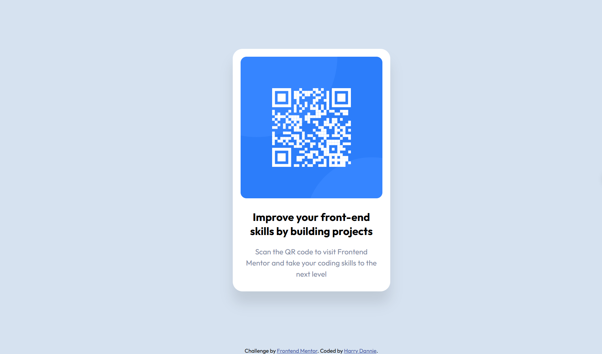

# Frontend Mentor - QR code component solution

## Table of contents
- [Overview](#overview)
  - [Screenshot](#screenshot)
  - [Links](#links)
- [My process](#my-process)
  - [Built with](#built-with)
  - [What I learned](#what-i-learned)
- [Author](#author)

## Overview
### Screenshot

### Links
- Solution URL: [My solution URL here](https://www.frontendmentor.io/solutions/html-structures-css-flexbox-grid-PclOezEFS2)
- Live Site URL: [My live site URL here](https://harry-28-nguyen.github.io/QR_code_component/)

## My process
### Built with
- Semantic HTML5 markup
- CSS custom properties
- Flexbox
- CSS Grid
### What I learned
Thank you a lot fronted-mentor. This would be a basic and necessary challenge for me to practice and as well help me acknowledge some basic structures I have learnt before. Overview, I have known to set up a layout before coding. Additionally, I can use devtool in Chrome such as a view for me to apply any code from the file and can see them imediately. I rarely use display: grid, just block and flex but when it comes to this challenge, I just found it and gratefully use as well learn it.

## Author
- Github - [harry-28-nguyen](https://github.com/harry-28-nguyen)
- Frontend Mentor - [@harry-28-nguyen](https://www.frontendmentor.io/profile/harry-28-nguyen)
